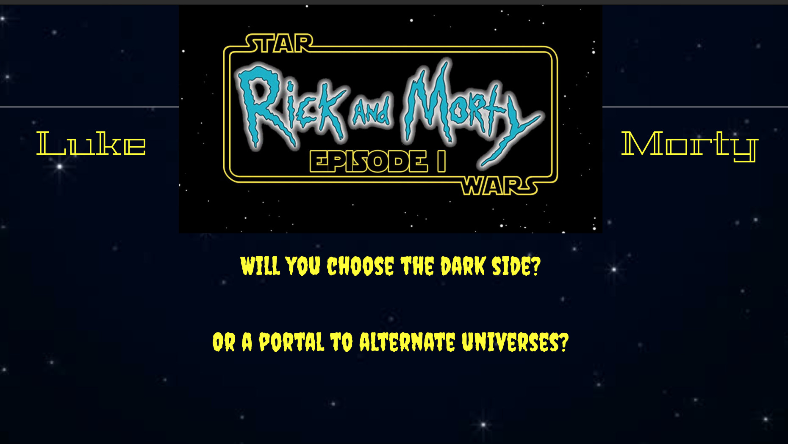

# Luke and Morty
Jeporady style quiz game featuring questions about Rick and Morty and Star Wars. This was a group project and I contributed the javascript for the Rick and Morty sections of the game.

## Description
In this project you can choose between either a quiz about Star Wars or Rick and Morty Trivia. You select your question dollar amount and then the question is presented to you.

Once you have finished answering all the questions you are then presented with a total amount for that round.  You can choose to either take the quiz again or go and try the other quiz.

## Links

[GitHub]("https://github.com/whit3hat/Luke-and-Morty")
[Application]("https://whit3hat.github.io/Luke-and-Morty/")